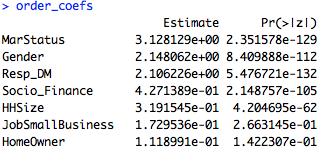

# Marketing Analytics Team Project 4: Bayesian Variable Selection and Customer Scoring

### Team members:
  * Samruddhi Somani
  * Wenyue Shi
  * Vivian Chu
  * Reshma Sekar
  * Qijing Zhang

## Executive Summary

We examine the difference between fitting a logistic regression using all given variables and logistic regressions using variables selected using the Bayesian Spike and Slab method. After reducing the variables, we study quadratic and interaction effects. We choose to keep quadratic terms for age and socio-financial orientation. Optimizing for profits using this model yields an optimal target of the top 2.13% in terms of response probabilities. This model yields higher profits than the full-variable model. FServ must also consider ways to reduce their fixed costs. Actual revenues do not justify \$100,000 fixed costs at a target population of 30,000. Similarly, expected revenues (calculated as response probabilities multiplied by revenue per response) do not justify \$100,000 fixed costs at a target population of 600,000.

## Scoring Model

We fitted a GLM model to the data, filtered coefficients by significance (p<0.05), and ranked coefficients by absolute value. Here are the top coefficients before exponentiating them back to original scale:

To improve interpretability, we exponentiated these coefficients:

## Interpretation

We see that marital status has the largest impact on odds of responding: They are 22.83 times more likely to respond than unmarried people.  Men are roughly 8.57 times more likely to respond than females. Respondents to previous mailings similarly are 8.22 times more likely to respond. For each additional point of financial orientation, a person is 1.5 times more likely to respond. Likewise, for each additional household member, a person is 1.37 times more likely. Lastly, people who own small businesses are 1.18 times more likely to respond.

## Bayesian Variable Selection

We used the Spike Slab method as implemented in the BoomSpikeSlab package. This variable selection method chooses 13 variables with inclusion probabilities greater than 0. We then fit another logistic regression using only these 13 variables, as opposed to the full 95. Only 8 of them are statistically significant.

## Transformations and Interactions
We add additional variables to account for quadratic effects and interaction effects. Middle-aged people have more assets and more family members to take care of, so they should be more likely to buy life insurance compared to younger or older people. Thus, age should have a quadratic effect. We also add a quadratic term for socio-financial orientation: People with higher levels of financial orientation may forgo insurance for higher-risk, higher-reward investments. Age squared is significant at the 1% level, and socio-finance squared is significant at the 10% level.

We also added the following interactions effects: age and gender, marital status and gender, marital status and unemployment rate, gender and unemployment status. Only marital status and gender is significant and then only at the 10% level. It is slightly negative, suggesting that married men respond less than unmarried men and married women. This may be due to relationship dynamics such that married women handle finances.

The best model out of these is the one with both quadratic terms with an AICC of 6023.9. This is better than the full-variable logistic regression, whose AICC is 6107.9. We will use this to validate our logistic regression built with Bayesian selected variables.

## Validation

We looked at mailing 0%-5% of all addresses in increments of 0.01%. There is gradual decrease in actual response rate: We do not see a sharp decrease.  We ran an optimization assuming a fixed cost of \$100,000, a variable cost of \$2.50, and a revenue of \$20 per response.

For our original GLM model, we should target the top 2.29%. This yields a maximum profit: -\$97,695. Our GLM with variables selected using the Spike and Slab method suggests targeting the top 2.13%. This yields a maximum profit of -\$97,635. The Bayesian model saves us \$60 by targeting 51 fewer people. We cannot achieve a positive profit due to the high fixed cost: Even targeting everyone only yields a revenue of \$6,840.

## Targeted Addresses

We use the GLM model with quadratic effects and variables selected using Spike and Slab. We will target the top 2.13% as recommended by our optimization over the holdout. The full address list is provided as a csv file. Expected revenues (calculated as response probabilities times \$20 revenue per response) is \$79,917.08, still lower than the fixed costs of \$100,000.

## Recommendations

We recommend that FServ reconsider their fixed costs and target population size. At a target population of 30,000 people, the profits -\$97,635. Similarly, expected revenues with a target population of 600,000 is \$79,917.08, still lower than the estimated fixed costs of \$100,000. We also recommend that they use the logistic model with the ten linear terms selected by Spike and Slab and quadratic terms for age and socio-financial orientation: This model suggests targeting the top 2.13% of the target population in terms of their response probabilities.

## Appendix

Name|0|1|  
--|--|--|   
Frequentist|29893|107
Bayesian|29890|110
Actual|29658|342

